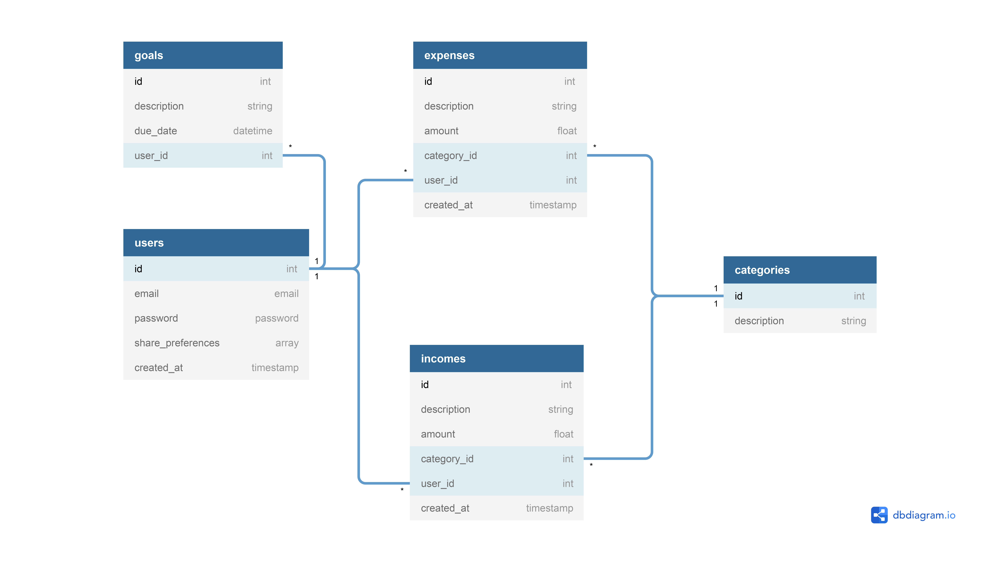

# T3A2 Budget-Tracker
Budget Tracking App created for Coder Academy T3A2 Full Stack assignment 

## Purpose
- 2020 has been a financially hard year worldwide so now, more than ever, it is important to implement a budget. But without a way to track your budget, there is no point making one.    
- This web application is designed to be a simple one stop shop for anyone who is wanting to track their personal expenses, incomes and shares without all the clutter.

## Functionality and features 
- By providing a simple, responsive and fluid user-interface, it allows people to view and adjust their budget at any time, no matter the device.  
- Integration of a fully featured real-time share and market tracking chart, storing user preferences and allowing them to focus on what matters.
- A range of other metric tracking charts will be implemented, to allow people to select and visually interpret things such as categories of expenses or their monthly expenditure.

## Target Audience
- The intended audience for this application is targeted towards users that are looking keep their finances and expenses under control. Users that own shares will also be able to find use out of this application by having a watch-list and real-time tracking graph analysis for shares of their choice.

## Tech Stack

#### *Frontend*
- React using Material-UI styled components

#### *Backend*
- Rails API
- PostgreSQL database
- Knock JWT authentication

#### *External Resources*
- TradingView finance widgets for tracking shares 
- ChartJS, displaying data on a range of charts
- React-beautiful-dnd
- Heroku web deployment platform
- Netlify deployment

#### *Testing*
- Rspec - For testing Rails code
- Jest + Cypress - For testing React/Javascript code

## Dataflow Diagram

### Entity Relational Diagram

## Application Architecture Diagram

## User Stories
- As Stacy, I want to be greeted with a landing page, so that
- As Stacy, I want to be able to create an account, so that
- As Max, I want to be able to update my account, so that
- As Max, I want to be able to update my password, so that
- As Max, I want to be able to reset my password, so that
- As Cam, I want to be able to log in, so that
- As Cam, I want to be able to log out, so that
- As John, I want to be able to enter an expense via a form, so that
- As John, I want to be able to add an expense description, so that
- As John, I want to be able to add an expense price, so that
- As John, I want to be able to add an expense category/s, so that
- As Holly, I want to be able to add an income via a form, so that
- As Holly, I want to be able to add an income description, so that
- As Holly, I want to be able to add an income price, so that
- As Holly, I want to be able to add an income category/s, so that
- As Kevin, I want to be able to edit any expenses I have entered, so that
- As Kevin, I want to be able to edit any incomes I have entered, so that
- As Samantha, I want to be able to delete any expenses I have entered, so that
- As Samantha, I want to be able to delete any incomes I have entered, so that
- As Tim, I want to be able to view my yearly expenses to date, so that
- As Tim, I want to be able to view my monthly expenses, so that
- As Tim, I want to be able to sort expenses based on categories, so that
- As Tim, I want to be able to view my categories in a range of charts, so that
- As Jimmy, I want to be able to view my selection of shares, so that
- As Jimmy, I want to be able to have a watch-list of my preferred shares, so that
- As Jimmy, I want to be able to customise my own watch-list, so that

## Wireframes

## Screenshots of Trello board
