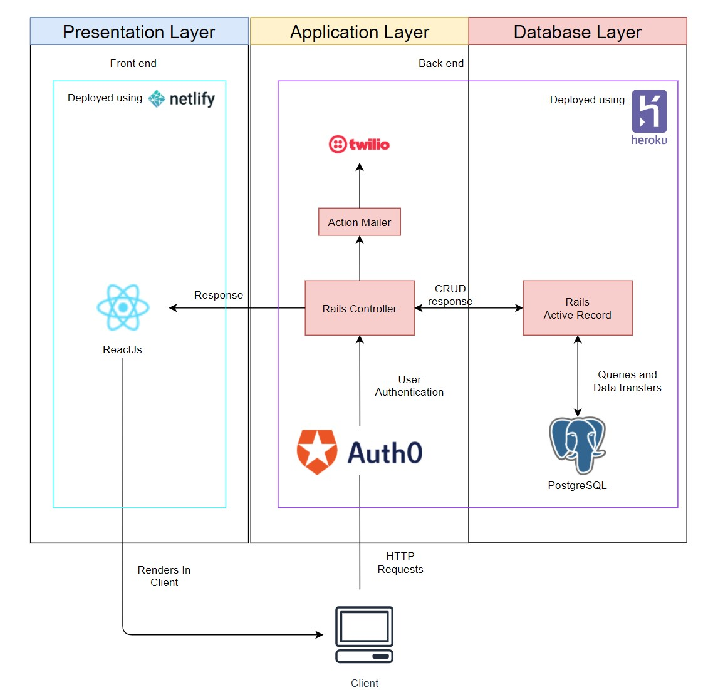
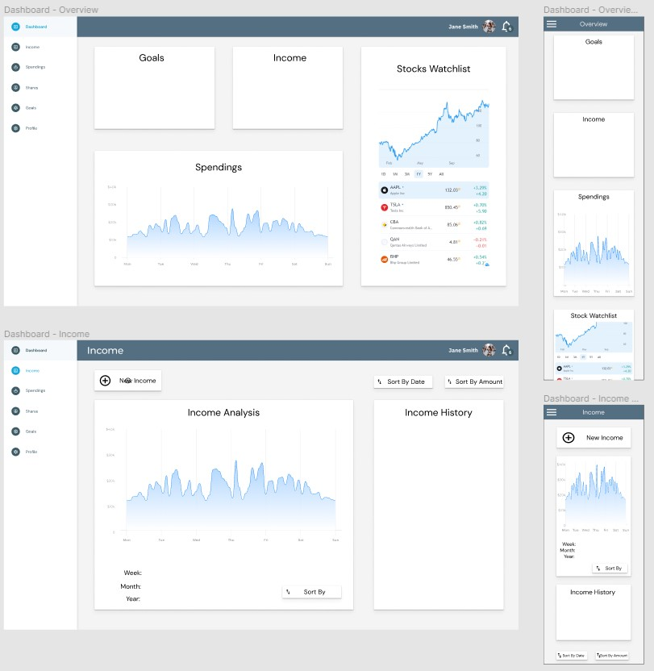
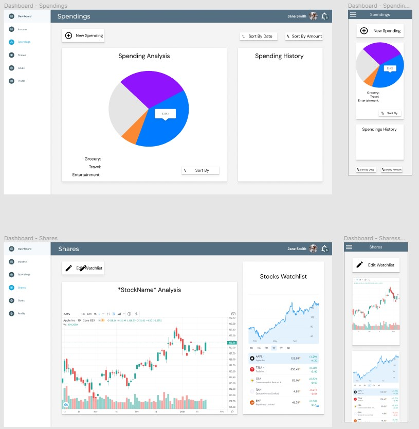

# T3A2 Final Assessment README

#### A link (URL) to your deployed website
https://tight20s.netlify.app/

#### A link to your GitHub repository (repo)
1. Front End - https://github.com/RoryMusinskas/budget_tracker_app_frontend
2. Back End - https://github.com/RoryMusinskas/budget_tracker_app_backend

### T3A2 Budget-Tracker Part A README contents
Budget Tracking App created for Coder Academy T3A2 Full Stack assignment 

## Purpose
- 2020 has been a financially hard year worldwide so now, more than ever, it is important to implement a budget. But without a way to track your budget, there is no point making one.    
- This web application is designed to be a simple one stop shop for anyone who is wanting to track their personal expenses, incomes and shares without all the clutter.

## Functionality and features 
- By providing a simple, responsive and fluid user-interface, it allows people to view and adjust their budget at any time, no matter the device.  
- Integration of a fully featured real-time share and market tracking chart, storing user preferences and allowing them to focus on what matters.
- A range of other metric tracking charts will be implemented, to allow people to select and visually interpret things such as categories of expenses or their monthly expenditure.

## Target Audience
- The intended audience for this application is targeted towards users that are looking keep their finances and expenses under control. Users that own shares will also be able t:w
- o find use out of this application by having a watch-list and real-time tracking graph analysis for shares of their choice.

## Tech Stack

#### *Frontend*
- React using Material-UI styled components

#### *Backend*
- Rails API
- PostgreSQL database
- Auth0 authorization + authentication
- JWT tokens

#### *External Resources*
- TradingView finance widgets for tracking shares 
- ChartJS, displaying data on a range of charts
- React-beautiful-dnd
- Heroku web deployment platform
- Netlify deployment

#### *Testing*
- Rspec - For testing Rails code
- Cypress - For testing React/Javascript code

## Dataflow Diagram


### Entity Relational Diagram


## Application Architecture Diagram


## User Stories

#### User
- As Stacy, I want to be greeted with a landing page, so that I can see the benefits of the website before I sign up
- As Stacy, I want to be able to create an account, so that I can use this service and track my budget
- As Max, I want to be able to update my account, so that I have my most up to date information
- As Max, I want to be able to update my password, so that I can keep my account safe
- As Max, I want to be able to reset my password, so that I can keep using this service if I forget it
- As Cam, I want to be able to log in, so that I know that my data is safe and secure
- As Cam, I want to be able to log out, so that I can leave my device and know people won't be able to access my information

#### Expenses
- As John, I want to be able to enter an expense via a form, so that I can track all my expenses for the month/year
- As John, I want to be able to add an expense description, so that I can remember the purchase and look for trends in spending  
- As John, I want to be able to add an expense price, so that I can track how much I am spending 
- As John, I want to be able to add an expense category/s, so that I can organise my spending
- As Samantha, I want to be able to edit any expenses I have entered, so that I can ensure the data is correct if I make a mistake
- As Samantha, I want to be able to delete any expenses I have entered, so that I can ensure that only the expenses I have displayed are relevant
- As Tim, I want to be able to view my monthly expenses, so that I can get a more detailed breakdown of what I am spending my money on
- As Tim, I want to be able to view my yearly expenses to date, so that I can be sure of how much money I have spent this year

#### Income
- As Holly, I want to be able to add an income via a form, so that I can track all my incomes for the month/year
- As Holly, I want to be able to add an income description, so that I can remember the reason for the income
- As Holly, I want to be able to add an income price, so that I can track how much income I am receiving
- As Holly, I want to be able to add an income category/s, so that I can organise my income
- As Samantha, I want to be able to edit any incomes I have entered, so that I can ensure the data is correct if I make a mistake
- As Samantha, I want to be able to delete any incomes I have entered, so that I can ensure that only the incomes I have displayed are relevant
- As Ben, I want to be able to view my monthly income, so that I can get a more detailed breakdown of where my money is coming from
- As Ben, I want to be able to view my yearly income to date, so that I can be sure of how much money I have earned this year

#### Categories
- As Tim, I want to be able to sort expenses based on categories, so that I can have a overall breakdown in which categories I spend most of my money on
- As Tim, I want to be able to view my categories in a range of charts, so that I can get a visual representation of my spending habits

#### Shares
- As Jimmy, I want to be able to view my selection of shares, so that I am able to keep track of how my share prices are doing
- As Jimmy, I want to be able to have a watch-list of my preferred shares, so that I can keep track of shares that I own/interested in
- As Jimmy, I want to be able to customise my own watch-list, so that I can have a choice on which shares appear on my watch-list

#### Financial Goals
- As Beth, I want to be able to create a list of my financial goals, so I have something to aspire towards
- As Beth, I want to be able to add a goal description, so the goal has relevance
- As Beth, I want to be able to add a goal due date, to keep inline with SMART goal setting practices
- As Abbey, I want to move the goals into different buckets depending on status, so I can keep my goals on track for the year and
- As Abbey, I want to be able to complete and archive my financial goals, so I can refer to them in the future

## Wireframes

Link to Figma: https://www.figma.com/file/mm5X1Hgvh8IKJkEOKF8ahQ/Wireframe-T3A2?node-id=0%3A1

#### Landing Page

 
#### Log In & Sign up Page

 
#### Dashboard Page




## Screenshots of Trello board

Link to Trello board: https://trello.com/b/FQHhNQvr/t3a2-full-stack-app


#### Instructions on how to setup the app on a local machine 
Ensure that the .env.development file (react) and the master.key file (rails) is included in this submission
This is very important to ensure educators can run your code

#### Front End Client setup
   1. Clone the repository to your local machine - ```git clone git@github.com:RoryMusinskas/budget_tracker_app_frontend.git```
   2. Change directory into the cloned repository ```cd budget_tracker_app_frontend```
   3. Install node packages ```yarn install --check-files```
   4. Delete the .env file in the repository and move the .env.development file from the src directory in the submitted zip file into the root of the repository (If it is named 'env.development', rename it with a dot preceding the env '.env.development')
   5. Copy the cypress.env.json file from the src directory in the submitted zip file into the root of the repository

#### Backend API setup
   1. Clone the repository to your local machine - ```git clone git@github.com:RoryMusinskas/budget_tracker_app_backend.git```
   2. Change directory into the cloned repository ```cd budget_tracker_app_backend```
   3. Copy the 'master.key' file from the submitted zip file into the config folder within the repository
   4. Install required packages and gems ```yarn install --check-files && bundle install```
   5. Initialize the database ```rails db:create && rails db:migrate && rails db:seed``

#### Running development environment
   1. From the 'front end repository' run ```yarn start```, to launch the react front end Client
   2. From the 'back end repository' run ```rails s -p 3001```, to launch the rails backend api    
   3. You can log in with the following account if you want pre seeded data, or make a new account
        - email: e2e-testing@mydomain.com
        - password: Ujt3M8inOIkOu@Sr 

#### Cypress testing
  1. Shut down React and Rails API if they are still running
  2. From the 'back end repository', run ```RAILS_ENV=test rails db:test:prepare db:seed```, to seed the test database for categories
  3. From the 'back end repository' run ```rails s -e test -p 3001```, to launch a test database
  4. From the 'front end repository' run ```yarn run e2e```, to launch the cypress client
  5. From the cypress GUI client, click the 'run 5 integration specs' button or an individual spec as needed.
  
#### Rspec Testing
1. From the backend repository, run ```bin/rspec -fd```

#### List of libraries used for both client and server

#### *Frontend*
- React using Material-UI styled components

#### *Backend*
- Rails API
- PostgreSQL database
- Auth0 authorization + authentication
- JWT tokens

#### *External Resources*
- TradingView finance widgets for tracking shares - Trading view is a world renowned share tracking widget with simple integration via the use of scripts. This allows users to easily track their personal shares, market trends or get really deep into the analytics of a particular stock. 
- ChartJS, displaying data on a range of charts - ChartJS allows users to easily identify their expenses and incomes through a range of charts, split up by categories. This allows for easy visual analysis of any metric.
- React-beautiful-dnd - A simple library which allows the creation of drag and drop interfaces, much akin to a kanban board. We have used this to allow for users to track financial goals they would like to achieve.
- React-reveal - Used for animations on the landing page, these are triggered as the user moves into the react-reveal components. A very simple library that brings a static component to life.
- React-date-picker - We have implemented this to allow for users to set dates of expenses or incomes. They can use these recorded dates to further analyse their spending habits. 
- Heroku web deployment platform - A simple way to deploy our backend API to interact with our deployed React frontend application.  
- Netlify deployment - Used for hosting our React application and interact with our rails backend API and other external resources.

#### *Testing*
- Rspec - For testing Rails code
- Cypress - For testing React/Javascript code

#### Links to spreadsheets of manual tests
https://docs.google.com/spreadsheets/d/1KKCPj8LWNdMZk8WxoS7rp52PHaI6rBpdt-ThFeX9dqg/edit?usp=sharing 

#### Developer journal detailing project management and task delegation throughout the life cycle of the project

https://trello.com/b/FQHhNQvr/t3a2-full-stack-app 

Our development priorities were broken up and delegated as per our user stories. We partitioned them into broader categories and then we worked solo on a user story category each, so we were able to work at the same time but minimize the risk of conflicts. We each chose categories which interested us and would compliment our skills. This worked extremely well not only for minimizing conflicts, but also for each of us to have a clear goal to work towards and to be able to better reflect on timing required to complete each component.

Each day we would talk on Discord and basically do our own standup, so we would be aware of how one another are progressing along, if we have any blockers, if we could assist each other or if we could do anything more efficiently. We would also move tasks from their respective user story board, to the doing bucket and these would then be moved to the complete bucket once the other team member has reviewed and completed the pull request on github. We also had a bucket we could move in progress work that was waiting on code from one another before we could finish it off. 

Jan 22 - Project Initialization, we both worked on getting the most basic of implementation started, this included making git repositories and creating the react front end and rails API backend projects. Added basic auth0 login flow, checking for tokens 

Jan 23 - The scaffold creation of the landing page, dashboard page, expenses page, goal page. Basically just the containers and a bit of styling to build upon as the project moves along.  Continued to develop the backend authentication flow together.

Jan 24 -  Added the external API scripts for our market tracking widgets and embedded them into their respective components. Cross checking work and following git workflow, finding our flow together and understanding how we both work.

Jan 25 - Lots of discussion about Auth0 flow and how best to refactor it as it wasn't as smooth as we liked. Refactoring of code we had already implemented for both performance and readability.

Jan 26 - Creation of the basic shares page, basic styling and embedding of the share widget components. 

Jan 27 - More work on the shares page, adding in a modal with logic to allow users to fetch from an api and select an exchange and a share they would like to track on the shares widget.

Jan 28 - Creation of the expenses page, basic styling and imports of relevant packages to facilitate features. On the backend, we made big progress with authentication, now allowing us to delete the user table and extract an identifier from the authentication process to use instead, this drastically increased our performance. Cleaned up a lot of backend code.

Jan 29 + 30 - Continued working on the expenses page, adding more logic for creating, editing and deleting expenses. Created the goals page and added the overall logic to move columns and goals but using premade data. Cleaned up more code from the backend and doing some basic rspec testing.  

Jan 31 - Streamlining of expenses page logic, increasing performance with fetching/posting data to and from the rails api. Added in the chart-js2 package and added basic chart. Added more functionality to goals page, allowing more dynamic data editing of headings and allowing users to create dynamic goals. 

Feb 1 - Continuing developing CRUD functionality of expenses page, more code cleanup and refactoring. Implemented more logic to the goals page for a better user experience and handling of edge cases in goal creation.

Feb 2 - Completed the CRUD functionality for the expenses page, adjusting routes accordingly for these updates. Imported cypress testing framework and completed testing for the shares page. Basic updating occurred on the backend to facilitate changes made in testing.

Feb 3 - Added basic functionality of the expenses analysis chart, showing each expense by category. Deployed the codebase to both Netlify and Heroku, this involved changing multiple things on both front and backend to allow for the two systems to work together with authentication. Big clean up of the code base, mostly things that were generated with the Material UI template we used.

Feb 4 - Implemented the pie-chart for the expenses page, added logic for category selection and styled the expenses page. Remade the landing page and added animations for a more positive user experience. More code cleanup in regards to the Material UI template we used. 

Feb 5 - Completion of the styling for the expenses page, including refactoring code and making it more modular. Basic implementation of dynamically rendering the user data onto the dashboard page. 

Feb 6 - Ported the expenses page into the income component, this included work on both the front and back end to ensure full functionality as per the expenses component. Backend validation of data for CRUD functionality. 

Feb 7 - More work on the dynamic rendering of the dashboard page. Working on a plan for the last 2 days of development to ensure we cover all required assessment criteria.

Feb 8 - More Rspec testing, adding in tests for routes and models, also added in factory-bot factories to assist with this. Deployed the site again, adjusted and tested with new data that is now stored in the app. Final touches on the expenses and incomes components adding more logic for more appropriate categories for both.

Feb 9 - Last cleanup of code, more cypress testing and manual testing to ensure MVP product. Lots of work on documentation and tying up loose ends for assignment submission.
